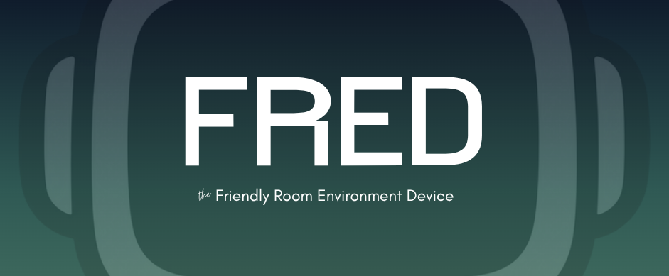
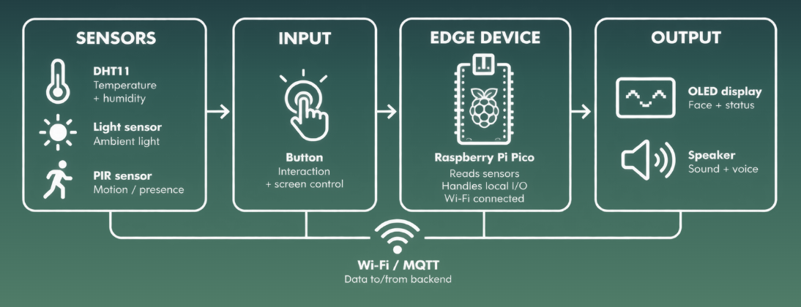
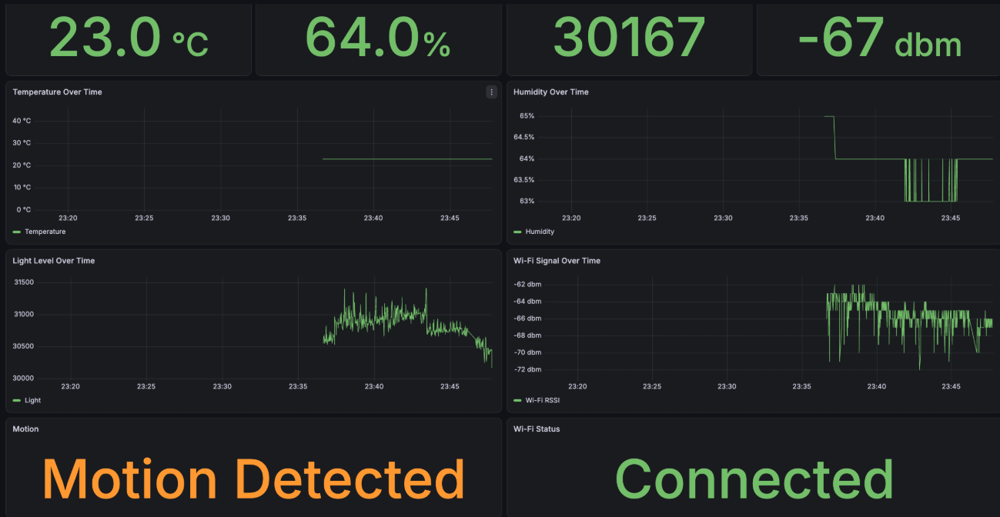
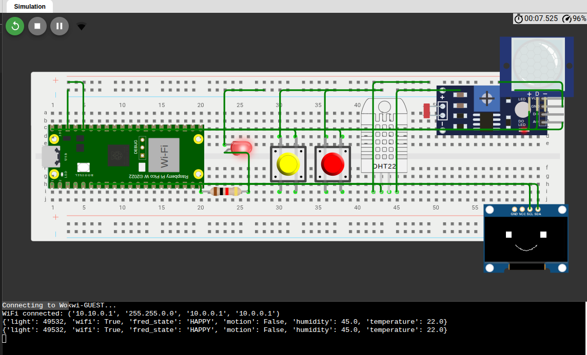

<p align="center">
  
  
  
  
  
  
  
  
</p>

<div align="center">
  
</div>

---

**FRED** is a connected room-pet that turns environmental and system data into moods, expressions and feedback.

Instead of only showing sensor values, FRED interprets how the room is doing and reflects that through a physical display, personality and observability dashboard.

## Overview

FRED collects room and network data from a Raspberry Pi Pico and sends it over MQTT to a Python backend.

The backend uses deterministic state logic to evaluate room conditions and derive FRED's current state. An optional LLM/TTS layer gives FRED personality, but never decides the actual state.

The diagram below shows FRED's core IoT pipeline. The optional LLM/TTS personality layer sits on top of this flow.


<div align="center">
  
</div>

## What FRED Monitors

- Temperature
- Humidity
- Light
- Motion
- Wi-Fi connectivity
- Signal strength
- Simulated noise level

Example state mappings:

```text
HEALTHY              → HAPPY
TOO_HOT / TOO_COLD   → UNCOMFORTABLE
TOO_DARK             → SLEEPY
TOO_NOISY            → OVERSTIMULATED
NETWORK_DEGRADED     → GRUMPY
OFFLINE              → DISCONNECTED
Incomplete sensor data → UNKNOWN
```

## Observability

Telemetry is stored in TimescaleDB and visualized in Grafana.

MLflow is used for tracing the optional LLM layer, while the core room and FRED state logic remains deterministic and independent of the LLM.

FRED can also send personality-driven updates to Discord, providing a lightweight notification channel alongside the physical device.

<div align="center">
  
</div>

## Wokwi Simulation

A simplified Wokwi version is included to demonstrate the hardware behavior without the physical device.

It uses:

- DHT22 instead of the physical DHT11
- SSD1306 instead of the physical SH1106
- the same GPIO mapping as the physical FRED
- local state logic instead of the full MQTT/backend pipeline

<div align="center">
  
</div>

## Tech Stack

| Area | Technology |
| --- | --- |
| Edge | Raspberry Pi Pico, MicroPython |
| Messaging | MQTT / Mosquitto |
| Backend | Python |
| Data | TimescaleDB |
| Observability | Grafana, MLflow |
| LLM / TTS | OpenAI, OpenRouter, Piper |
| Containers | Docker Compose |
| Deployment | Azure |
| Testing | pytest, Ruff |

## Deployment

FRED can run locally with Docker Compose and has also been deployed to Azure.

The cloud setup is automated with dedicated scripts for both deployment and teardown:

```text
azure/deploy.sh
azure/destroy.sh
```
This keeps the Azure environment reproducible and makes it easy to remove resources when they are no longer needed.

GitHub Actions provides CI for automated tests and linting, while Azure deployment is handled through the project deployment scripts.

## Run Locally

```bash
cp .env.example .env
docker compose up --build
```

Piper voice models are not included in the repository. Download both the model and config file before using TTS:

```bash id="7d6rm8"
wget https://huggingface.co/rhasspy/piper-voices/resolve/main/en/en_US/hfc_male/medium/en_US-hfc_male-medium.onnx \
  -O voices/en_US-hfc_male-medium.onnx

wget https://huggingface.co/rhasspy/piper-voices/resolve/main/en/en_US/hfc_male/medium/en_US-hfc_male-medium.onnx.json \
  -O voices/en_US-hfc_male-medium.onnx.json
```

Run tests:

```bash
pytest
ruff check .
```

## Project Docs

- **Bill of Materials:** <a href="https://docs.google.com/spreadsheets/d/1yisgF4Nyb32ZH6ohSaispSrN9NvamIa1ieXAlxI8pCQ/edit?gid=335269435#gid=335269435"> `BoM` </a>

- **Way of Working:** [`wow.md`](wow.md)
- **Wokwi:** <a href="https://wokwi.com/projects/475667296475077633"> `Wokwi` </a>

## Future Improvements

Possible next steps include:

- integrating the trained model into the room-state pipeline
- adding device freshness / `last_seen` monitoring
- expanding physical sensor coverage
- improving system-level observability

## Contributors

<div align="center">

<a href="https://github.com/omeraytug">

</a>
<a href="https://github.com/pytt156">

</a>

</div>